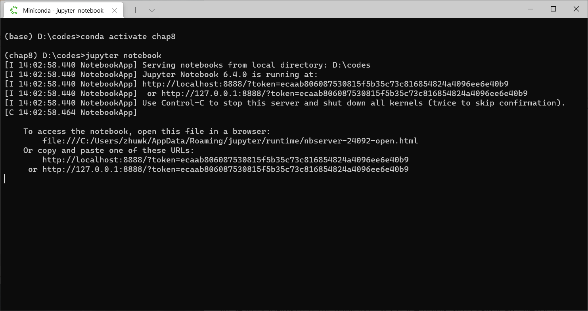
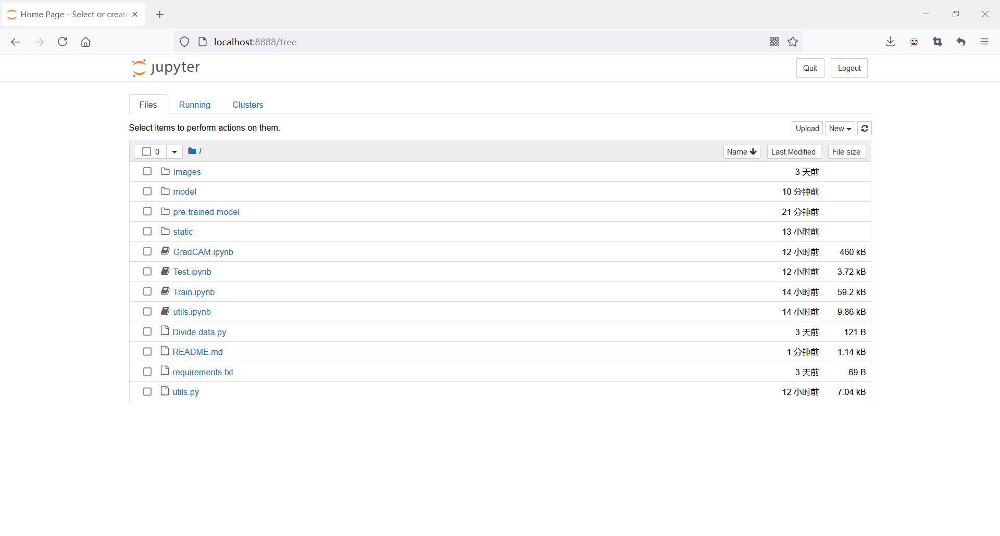
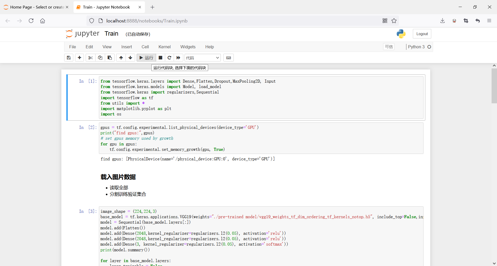
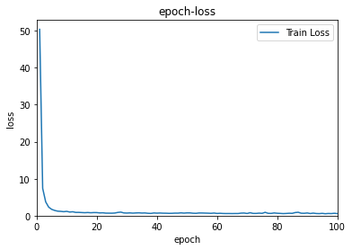
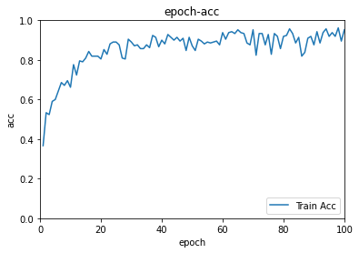
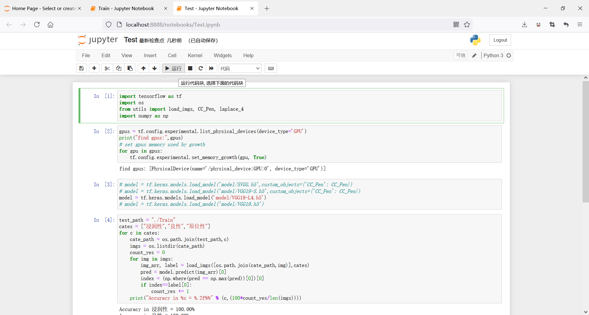
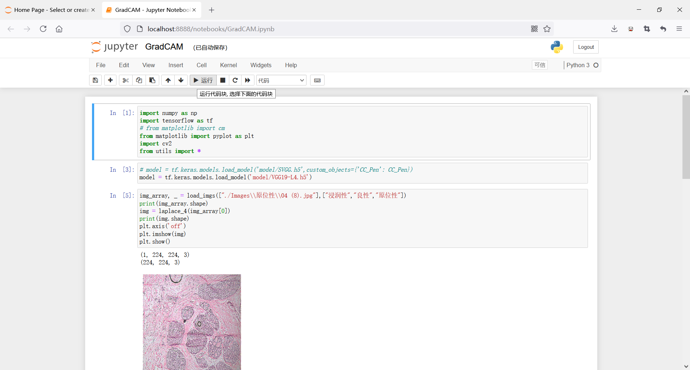
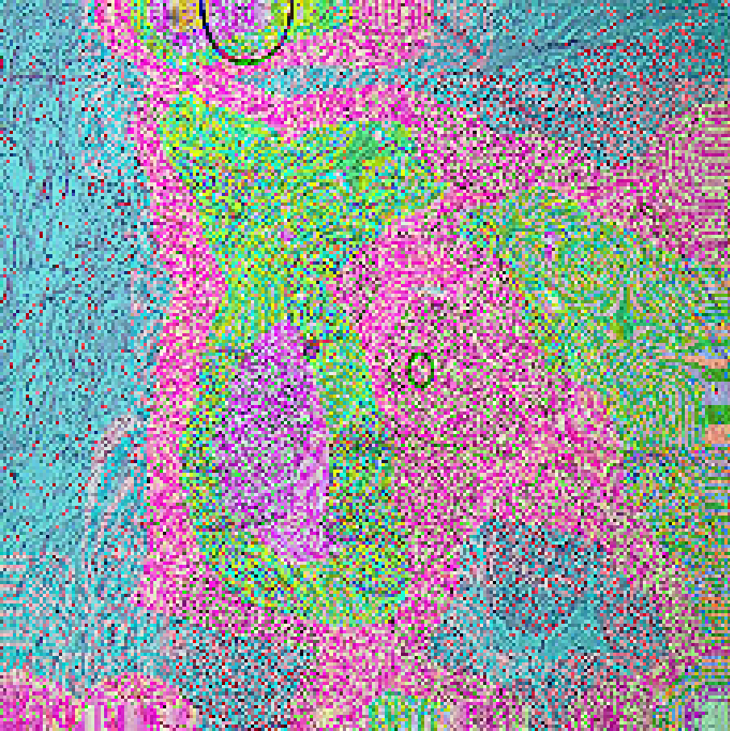

本仓库存放了 **《制造过程在线检测图像处理算法（李辉）》** 的第八章代码，文件目录结构如下：

```
- Images
  - 浸润性
  - 良性
  - 原位性
- pre-trained model
- model
- static
- Divide data.py
- GradCAM.ipynb
- Train.ipynb
- Test.ipynb
- utils.ipynb
- utils.py
- requirements.txt
```

代码运行环境推荐使用`conda`（详细安装和配置步骤见书），运行步骤如下。

## 1. 安装需要的库

```bash
pip install -r requirements.txt -i https://mirrors.aliyun.com/pypi/simple
```

## 2. 数据集划分

```bash
python "Divide data.py"
```

## 3. 运行训练程序

首先打开代码编辑器`jupyter`，会自动弹出浏览器，

```bash
jupyter notebook
```





然后在浏览器界面中打开`Train.ipynb`文件，逐次点击页面上方的运行或者从上往下使用快捷键`Shift`+`Enter`执行所有代码块。



运行结束之后，会将训练过程中的损失（loss）和准确率（acc）以图像和表格的形式保存在`static`文件夹下，如下方图片所示为`VGG19+L4`模型的训练过程中损失和准确率。



## 4. 运行测试程序

在浏览器界面中打开`Test.ipynb`文件，逐次点击页面上方的运行或者从上往下使用快捷键`Shift`+`Enter`执行所有代码块。



## 5. 模型判断可视化

在浏览器界面中打开`GradCAM.ipynb`文件，逐次点击页面上方的运行或者从上往下使用快捷键`Shift`+`Enter`执行所有代码块。



下方为`SVGG`模型判断一张原位性图片的可视化分析图像。


